# Architecture Visuelle - Module Adresses

Ce document présente l'architecture du module Adresses avec des diagrammes visuels.

## 📊 Structure du Module

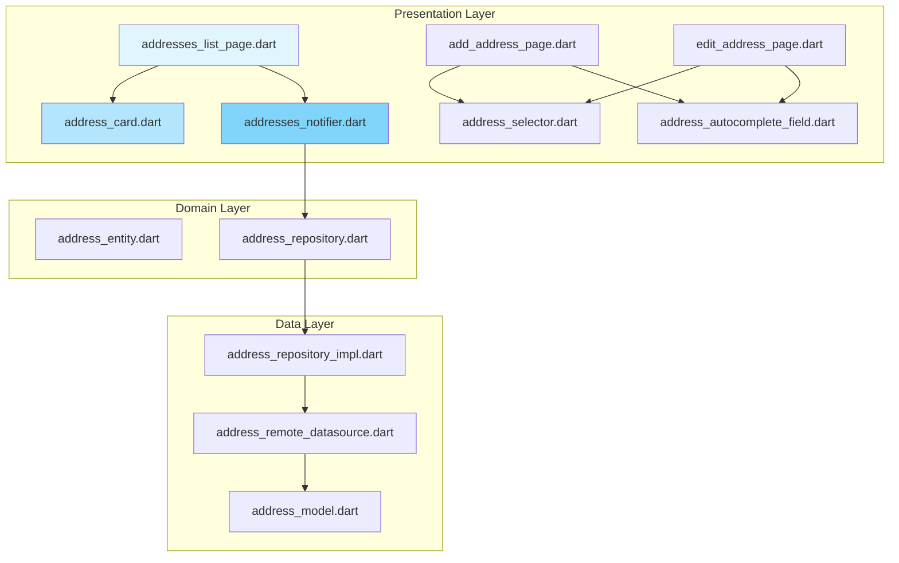

## 🔄 Flux de Données

### Chargement des adresses

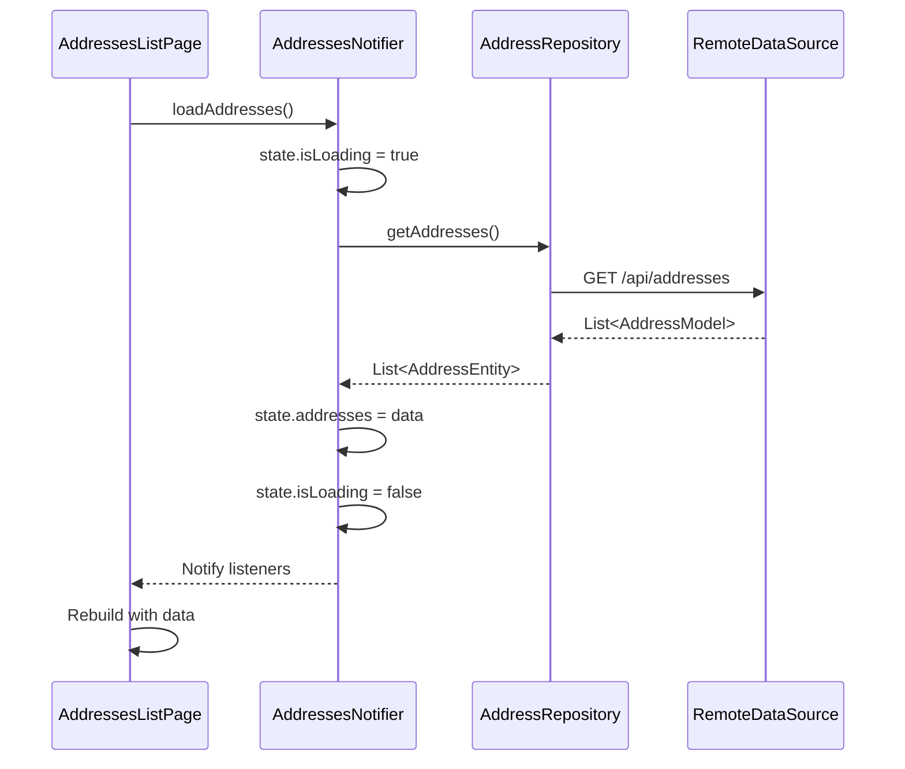

### Suppression d'adresse (avec confirmation)

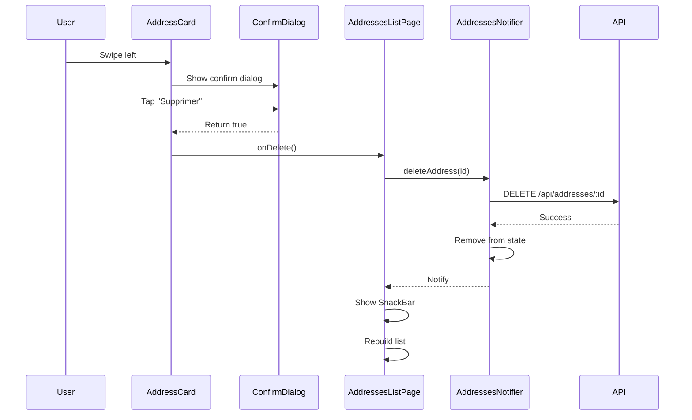

## 🏗️ Architecture Avant vs Après

### Avant (v1.0.0)

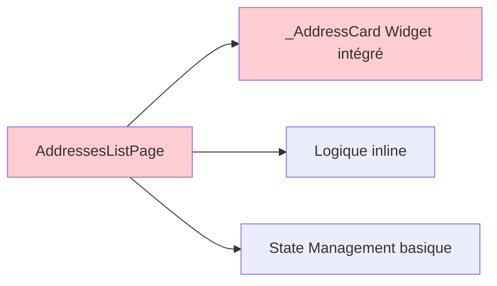

**Problèmes** :
- Widget non réutilisable
- Difficile à tester
- Code dupliqué
- Pas d'animations
- UX limitée

### Après (v2.0.0)

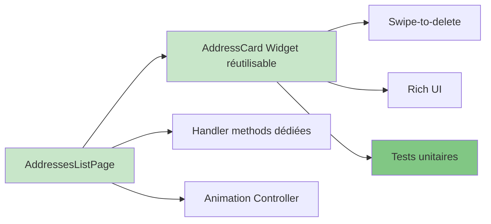

**Avantages** :
- Widget réutilisable partout
- Hautement testable
- Code maintenable
- Animations fluides
- UX moderne

## 🎨 Composants du Widget AddressCard

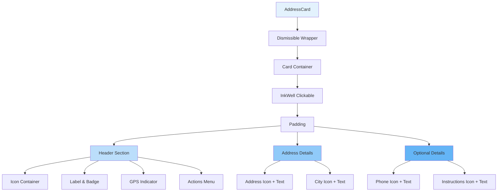

## 📱 États de l'Interface

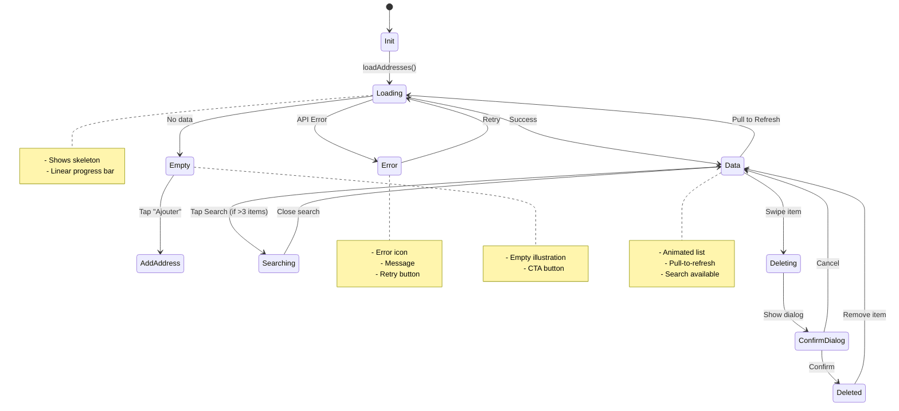

## 🎬 Animation Timeline

```mermaid
gantt
    title Animation d'entrée progressive (Stagger Effect)
    dateFormat X
    axisFormat %Lms
    
    section Carte 1
    Fade In       :0, 150
    Slide In      :0, 150
    
    section Carte 2
    Fade In       :50, 200
    Slide In      :50, 200
    
    section Carte 3
    Fade In       :100, 250
    Slide In      :100, 250
    
    section Carte 4
    Fade In       :150, 300
    Slide In      :150, 300
```

**Configuration** :
```dart
Interval(
  (index / items.length) * 0.5,           // Start
  ((index + 1) / items.length) * 0.5 + 0.5, // End
  curve: Curves.easeOut,
)
```

## 🧪 Architecture de Test

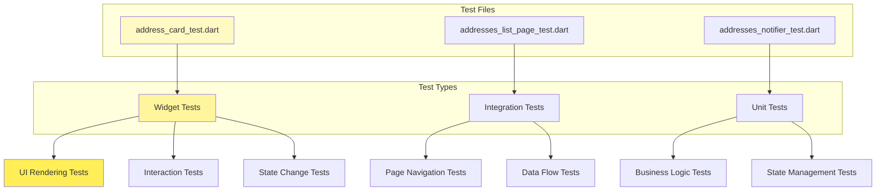

## 📋 Checklist de Qualité

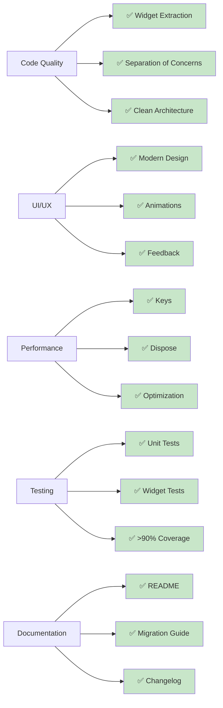

## 🚀 Déploiement

### Processus de Release

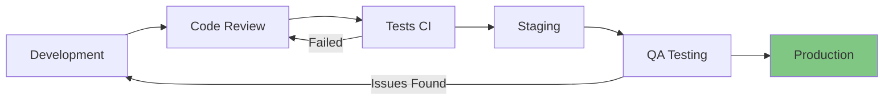

### Checklist de Release

- [ ] Tous les tests passent
- [ ] Code review approuvé
- [ ] Documentation à jour
- [ ] Changelog mis à jour
- [ ] Version bumpée
- [ ] Migration guide prêt
- [ ] Déployé en staging
- [ ] QA validé
- [ ] Prêt pour production

---

**Note** : Ces diagrammes sont générés avec Mermaid et peuvent être visualisés directement dans GitHub/GitLab.

Pour modifier les diagrammes :
1. Éditer ce fichier Markdown
2. Utiliser la syntaxe [Mermaid](https://mermaid.js.org/)
3. Prévisualiser dans votre éditeur Markdown

---

**Dernière mise à jour** : 9 avril 2026
**Maintenu par** : L'équipe Mobile DR-PHARMA
